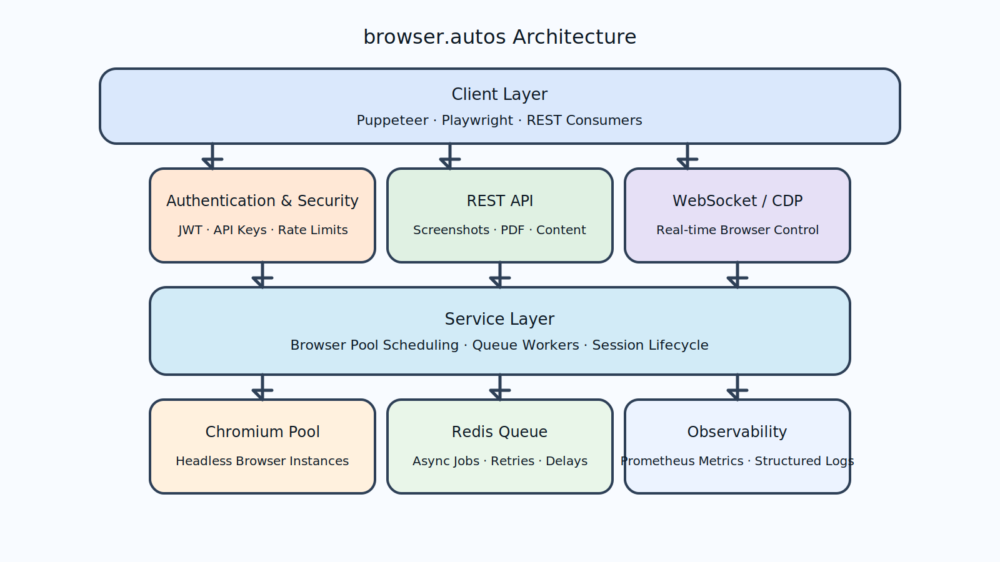

<div align="center">


# browser.autos

**Cloud-Native Headless Browser Automation API**

[](https://hub.docker.com/r/browserautos/browser-autos)
[](https://github.com/browser-autos/browser-autos)
[](LICENSE)

[🌐 Website](https://browser.autos) | [📘 Documentation](./docs/) | [🐳 Docker Hub](https://hub.docker.com/r/browserautos/browser-autos) | [🇨🇳 中文文档](./README_CN.md)

</div>

---

## ⚡ Quick Start

### Using Docker (Recommended)

```bash
docker run -d -p 3001:3001 \
  -e JWT_SECRET=your-secret-key \
  -e DEFAULT_ADMIN_USERNAME=browserautos \
  -e DEFAULT_ADMIN_PASSWORD=browser.autos \
  --shm-size=2gb \
  browserautos/browser-autos:latest

# Test it
curl http://localhost:3001/health

# Check logs to see default credentials
docker logs browser-autos | grep "Default credentials"

# Explore interactive API docs (Swagger UI)
open http://localhost:3001/docs
```

### From Source

```bash
# Clone repository
git clone git@github.com:browser-autos/browser-autos.git
cd browser-autos

# Install dependencies
npm install

# Start development server
npm run dev

# API available at http://localhost:3001

# Swagger UI available at http://localhost:3001/docs
# OpenAPI JSON available at http://localhost:3001/docs/json
```

---

## 🎯 What is browser.autos?

**browser.autos** is a cloud-native headless browser platform that provides:

- **REST APIs** - Screenshots, PDFs, content extraction, web scraping
- **WebSocket Proxy** - Full CDP protocol access for Puppeteer/Playwright
- **Browser Pool** - 85% faster with automatic instance reuse
- **Queue System** - Redis-backed async processing
- **Multi-Arch** - AMD64 + ARM64 (Apple Silicon, AWS Graviton)
- **Production Ready** - JWT auth, Prometheus metrics, health checks

---

## 🧭 Core Endpoints

| Feature | Endpoint | Status |
| --- | --- | --- |
| Health check | `GET /health` | ✅ returns service + queue stats |
| Metrics (Prometheus) | `GET /metrics` | ✅ exports browser pool + queue metrics |
| Swagger UI | `GET /docs` | ✅ interactive REST explorer |
| OpenAPI spec | `GET /docs/json` | ✅ machine-readable schema |
| Screenshot API | `POST /screenshot` | ✅ capture PNG/JPEG/WebP |
| PDF API | `POST /pdf` | ✅ generate configurable PDFs |
| Content extraction | `POST /content` | ✅ extract HTML/text/meta |
| Web scraping | `POST /scrape` | ✅ selector-based scraping |
| Session management | `GET /sessions` | ✅ inspect/close active sessions |
| Queue management | `/queue/*` | ✅ submit + manage async jobs |
| WebSocket CDP proxy | `ws://<host>/ws` | ✅ direct Puppeteer/Playwright tunnel |

All endpoints are registered automatically when the server boots. The Swagger UI reflects the latest schemas directly from the Fastify route definitions, so you can try requests in the browser with either JWT Bearer tokens or API keys.【F:src/server.ts†L40-L140】【F:src/config/swagger.ts†L13-L95】【F:src/config/swagger.ts†L281-L310】

---

## 🚀 Use Cases

- 📸 **Screenshot Service** - Visual regression testing, thumbnails
- 📄 **PDF Generator** - Reports, invoices at scale
- 🕷️ **Web Scraper** - Price monitoring, content aggregation
- 🧪 **Testing Platform** - E2E tests, CI/CD integration
- 👀 **Monitoring System** - Change detection, uptime checks

---

## 🔁 Queue & Redis Support

- The asynchronous task queue is powered by Bull + Redis and is **disabled by default**.
- Enable it by setting `ENABLE_QUEUE=true` and providing `REDIS_URL=redis://<host>:6379`.
- When enabled, queue stats surface automatically in `/health`, `/metrics`, and the Swagger docs for `/queue` endpoints.【F:src/config/index.ts†L69-L116】【F:src/server.ts†L140-L198】

Sample Docker run command with queue enabled:

```bash
docker run -d -p 3001:3001 \
  -e JWT_SECRET=your-secret-key \
  -e ENABLE_QUEUE=true \
  -e REDIS_URL=redis://redis:6379 \
  --link redis \
  browserautos/browser-autos:latest
```

---

## 📈 Observability

- Prometheus metrics exposed at `GET /metrics`, including HTTP latency, browser pool utilisation, and queue depth.
- Structured logs via Pino with request IDs for traceability.
- Health endpoint summarises uptime, active sessions, and queue status for readiness/liveness probes.【F:src/server.ts†L129-L198】

---

## 🧠 WebSocket CDP Proxy

Connect automation frameworks directly to Chromium via the built-in WebSocket proxy:

```javascript
const browser = await puppeteer.connect({
  browserWSEndpoint: 'ws://localhost:3001/ws'
});
```

Each connection provisions an isolated Chromium instance with the same launch arguments used by the REST APIs, ensuring consistent behaviour across both integration styles.【F:src/api/websocket/proxy.route.ts†L1-L118】

---

## 📚 Documentation

- **[API Documentation](./docs/)** - Complete API reference
- **[Docker Deployment](./docs/DOCKER_README.md)** - Production deployment guide
- **[Credentials Guide](./docs/CREDENTIALS_GUIDE.md)** - Authentication setup
- **[API Examples](./docs/)** - Code examples and tutorials

---

## 🏗️ Architecture



**Simple. Scalable. Reliable.**

---

## 🤝 Contributing

We welcome contributions! See our [contributing guidelines](./CONTRIBUTING.md) for details.

---

## 📄 License

MIT License - Free for commercial use.

---

<div align="center">

**Built with ❤️ by the browser.autos team**

[Website](https://browser.autos) · [Docker Hub](https://hub.docker.com/r/browserautos/browser-autos) · [Documentation](./docs/)

</div>
